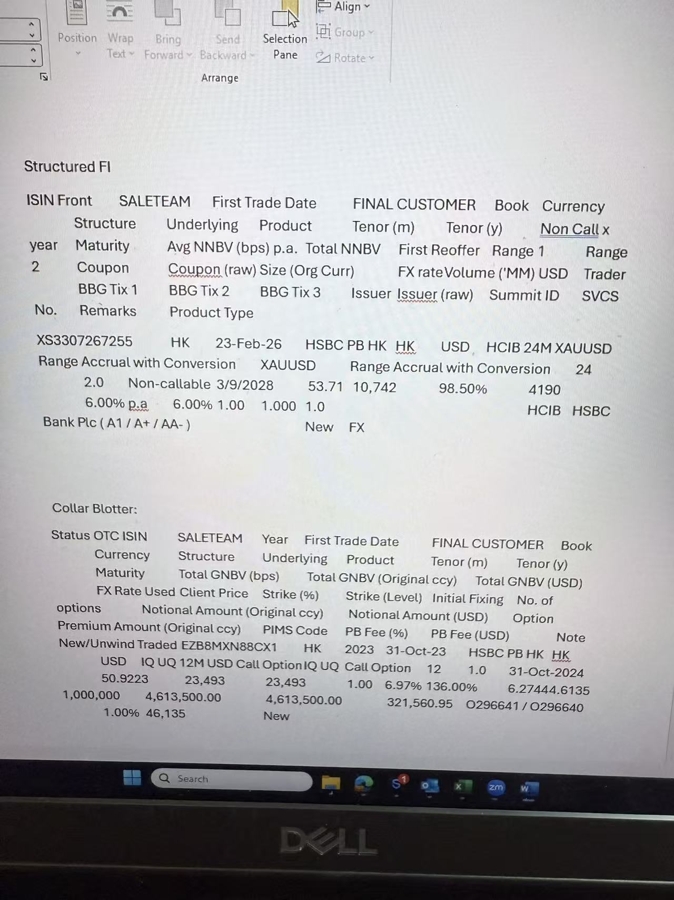
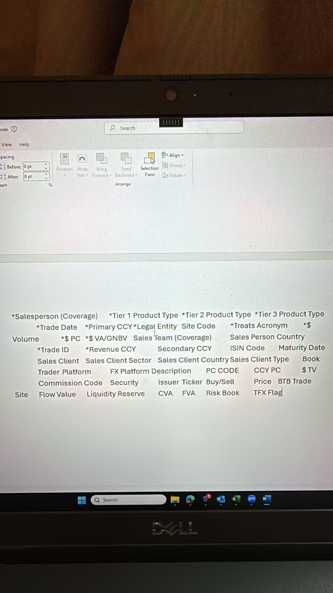

# Non-Linear Product Source Template Inventory

Generated: 2026-07-18  
Mission: expand the Centralised Blotter mapper beyond the original Linear Zero flow to cover Structured FI, Collar, Illiquid Credit + Repack, and Equity TRS without losing the original template integrity.

## Source Evidence

The supplied screenshot was copied into the repo for auditability:

The supplied output-template header screenshot was also copied into the repo:

Visible in this screenshot:

- Structured FI source columns plus one example row.
- Collar Blotter source columns plus one example row.

Not visible in this screenshot:

- Illiquid Credit + Repack columns/example row.
- Equity TRS columns/example row.

For Illiquid Credit + Repack and Equity TRS, the inventory below uses the current runnable mapper and recovered OCR registry as the working source until the original template screenshot/example row is supplied. Those two sections should therefore be treated as implementation coverage, not final screenshot-confirmed source evidence.

Minimum one-row-per-family test cases are documented in `docs/non_linear_test_cases.md`.

## Blank And Uncertain Field Policy

- Preserve genuinely blank source cells as blank unless a reference lookup, Mapping Studio rule, or configured placeholder is explicitly intended to fill them.
- Do not infer firm identifiers from nearby text when the source cell is blank.
- Where OCR or photo alignment is uncertain, keep the value as "observed/uncertain" and verify against the workbook before hard-coding parser logic.
- Dates should continue to be emitted to the output template as `dd/mm/yyyy`.
- `*$ Volume` is the PLUTO output amount field.
- `*Trade ID` must export as a numeric value. Alphanumeric native references remain traceable through `ISIN Code` and/or `Comment`.
- PLUTO is the output template. Every PLUTO/output field beginning with `*` has to be populated, including `*$ Volume`.
- Reoffer-based `Price` fields use the OCR-original price-point normalization: `98.50%`, `98.5`, and `0.985` all output as `98.5`. This applies to Structured FI / Linear Zero reoffer fields and Illiquid/Repack `Reoffer`; TRS `Net Price`/`Gross Price` remains a direct numeric source price.

## New Built-In Policy Mappings

These rules are built-in defaults. Product reference CSVs, Mapping Studio rules, and manual overrides still take precedence.

| Source signal | `*Tier 1 Product Type` | `*Tier 2 Product Type` | `*Tier 3 Product Type` |
|---|---|---|---|
| Linear Zero Callable Notes in current Structured FI layout | Structured Rates | Interest Rate Linked Note -PPN | Interest Rate Linked Note -PPN |
| Range Accrual with Conversion in current Structured FI layout | Structured Rates | Interest Rate Linked Note -PPN | Range Accrual with Conversion |
| CLN / Credit Linked Note(s) | Structured Credit | Structured Credit | Credit Linked Note |
| Repackaged / Repack / Illiquid Credit | Structured Credit | Structured Credit | Structured Credit Notes |
| Private Credit / Private Placement | Private Credit Primary | Private Placement | Private Placement |

Built-in Treats fallback:

| Source/client signal | `*Treats Acronym` |
|---|---|
| Nomura Private Bank / Nomura PB | `NOSGSGH` |
| HASE / Hang Seng | `HASEHKP` |

## Structured FI

Screenshot-confirmed source family: first block in supplied image. This is the expansion of the Structured FI / Linear Zero lineage.

### Observed Columns

| Column | Current mapper use | Notes |
|---|---|---|
| `ISIN Front` | Native trade ID candidate; ISIN Code candidate | Source ID preferred over synthetic ID. |
| `SALETEAM` | Sales Team (Coverage) source; coverage lookup key | Example row shows `HK`. |
| `First Trade Date` | `*Trade Date` | Output formatted `dd/mm/yyyy`. |
| `FINAL CUSTOMER` | Sales Client | Example row shows `HSBC PB HK`. |
| `Book` | Book; legal lookup key | Example row shows `HK`. |
| `Currency` | `*Primary CCY`; `CCY PC` fallback | Example row shows `USD`. |
| `Structure` | Security / structureName | Example row shows Range Accrual with Conversion. |
| `Underlying` | Ticker / underlying | Example row shows `XAUUSD`. |
| `Product` | Product classification helper | Example row shows Range Accrual with Conversion. |
| `Tenor (m)` | Informational / possible maturity helper | Example row shows `24`. |
| `Tenor (y)` | Informational / possible maturity helper | Example row shows `2.0`. |
| `Non Call x year` | Informational / callable feature | OCR split across two visual lines. |
| `Maturity` | Maturity Date | Example row shows `3/9/2028`; verify workbook date interpretation. |
| `Avg NNBV (bps) p.a.` | Informational / economics | Not currently a primary output field. |
| `Total NNBV` | `*$ VA/GNBV` candidate | Example row shows `10,742`. |
| `First Reoffer` | Price | Example row shows `98.50%`; normalized to price points (`0.985` -> `98.5`, `98.50%` -> `98.5`). |
| `Range 1` | Product-specific economics | Example row appears to show `4190`; alignment uncertain. |
| `Range 2` | Product-specific economics | May be blank in the visible row. |
| `Coupon` | Product-specific economics | Example row shows `6.00% p.a`. |
| `Coupon (raw)` | Product-specific economics | Example row shows `6.00%`. |
| `Size (Org Curr)` | `*$ Volume` fallback via size x FX | Example row shows `1.00` or similar; alignment uncertain. |
| `FX rate` | `*$ Volume` fallback FX | Example row shows `1.000`. |
| `Volume ('MM) USD` | `*$ Volume` candidate | Example row shows `1.0`; mapper scales MM to USD. |
| `Trader` | Trader | Example row appears to show `HCIB`; alignment uncertain. |
| `BBG Tix 1` | Alternate ticker candidate | Not currently the first Structured FI ticker source. |
| `BBG Tix 2` | Alternate ticker candidate | May be blank in the visible row. |
| `BBG Tix 3` | Alternate ticker candidate | May be blank in the visible row. |
| `Issuer` | Issuer | Example row appears to include `HSBC`. |
| `Issuer (raw)` | Issuer raw / legal lookup helper | Example row includes `Bank Plc (A1/A+ / AA-)`; exact issuer name is visually split. |
| `Summit ID` | Native trade ID fallback | Example row appears to show `4190`; alignment uncertain. |
| `SVCS No.` | Native trade ID fallback | May be blank in the visible row. |
| `Remarks` | Comment / source action helper | Example row shows `New`. |
| `Product Type` | Asset subtype classification | Example row shows `FX`. |

### Example Row Snapshot

| Field | Observed value |
|---|---|
| ISIN Front | `XS3307267255` observed; OCR confidence medium |
| SALETEAM | `HK` |
| First Trade Date | `23-Feb-26` |
| FINAL CUSTOMER | `HSBC PB HK` |
| Book | `HK` |
| Currency | `USD` |
| Structure | `Range Accrual with Conversion` |
| Underlying | `XAUUSD` |
| Product | `Range Accrual with Conversion` |
| Tenor | `24` months / `2.0` years |
| Maturity | `3/9/2028` |
| Total NNBV | `10,742` |
| First Reoffer | `98.50%` |
| Coupon | `6.00% p.a` |
| Product Type | `FX` |

### Implementation Notes

- Structured FI should remain a source-backed expansion of Linear Zero, not a separate output template.
- The current parser classifies Structured FI into Rate, Credit, FX, or Unknown using `Product Type` first and then Product/Underlying/Structure heuristics.
- After the current Structured FI layout is recognized, `Product`/`Structure` text applies product-specific taxonomy: `Linear Zero Callable Notes` keeps the OCR Linear Zero rates tiers; `Range Accrual with Conversion` keeps the rates family but uses `Range Accrual with Conversion` for tier 3; `CLN` maps to Structured Credit tiers and takes priority when CLN and Range Accrual wording both appear.
- Fields like Range 1, Range 2, Coupon, Coupon raw, BBG Tix 2, and BBG Tix 3 are source evidence but do not yet have direct target-template destinations unless rules are added.

## Collar Blotter

Screenshot-confirmed source family: second block in supplied image.

### Observed Columns

| Column | Current mapper use | Notes |
|---|---|---|
| `Status` | Source action/status helper | Current parser primarily uses `New/Unwind`; confirm whether `Status` and `New/Unwind` are separate columns. |
| `OTC ISIN` | Native trade ID candidate; ISIN Code | Example row shows `EZB8MXN88CX1`. |
| `SALETEAM` | Sales Team (Coverage) source; coverage lookup key | Example row shows `HK`. |
| `Year` | Informational | Example row shows `2023`. |
| `First Trade Date` | `*Trade Date` | Example row shows `31-Oct-23`. |
| `FINAL CUSTOMER` | Sales Client | Example row shows `HSBC PB HK`. |
| `Book` | Book; legal lookup key | Example row shows `HK`. |
| `Currency` | `*Primary CCY`; `CCY PC` fallback | Example row shows `USD`. |
| `Structure` | Security / structureName | Example row appears to show `IQ UQ 12M USD Call Option`. |
| `Underlying` | Ticker / underlying | Example row shows `IQ UQ`. |
| `Product` | Product / call-put leg descriptor | Example row shows `Call Option`. |
| `Tenor (m)` | Informational / possible maturity helper | Example row shows `12`. |
| `Tenor (y)` | Informational / possible maturity helper | Example row shows `1.0`. |
| `Maturity` | Maturity Date | Example row shows `31-Oct-2024`. |
| `Total GNBV (bps)` | Product-specific economics | Example row shows `50.9223`. |
| `Total GNBV (Original ccy)` | Product-specific economics | Example row shows `23,493`. |
| `Total GNBV (USD)` | `*$ VA/GNBV` | Example row shows `23,493`. |
| `FX Rate Used` | FX helper | Example row shows `1.00`. |
| `Client Price` | Price | Example row shows `6.97%`. |
| `Strike (%)` | Product-specific economics | Example row shows `136.00%`. |
| `Strike (Level)` | Product-specific economics | Example row shows `6.27444.6135`; OCR/visual alignment uncertain. |
| `Initial Fixing` | Product-specific economics | Example row value alignment uncertain. |
| `No. of options` | Product-specific quantity | Example row value alignment uncertain. |
| `Notional Amount (Original ccy)` | Source notional | Example row shows `1,000,000`. |
| `Notional Amount (USD)` | `*$ Volume` | Example row shows `4,613,500.00`. |
| `Option Premium Amount (Original ccy)` | Product-specific economics | Example row shows `4,613,500.00`; verify alignment. |
| `PIMS Code` | Native trade ID candidate | Example row shows `0296641 / 0296640`. |
| `PB Fee (%)` | PC economics | Example row shows `1.00%`. |
| `PB Fee (USD)` | `*$ PC` waterfall candidate | Example row shows `46,135`. |
| `Note` | Comment | May be blank in the visible row. |
| `New/Unwind` | Buy/Sell derivation | Example row shows `New`; current mapper maps New to Buy and Unwind to Sell. |

### Example Row Snapshot

| Field | Observed value |
|---|---|
| OTC ISIN | `EZB8MXN88CX1` |
| SALETEAM | `HK` |
| Year | `2023` |
| First Trade Date | `31-Oct-23` |
| FINAL CUSTOMER | `HSBC PB HK` |
| Book | `HK` |
| Currency | `USD` |
| Structure | `IQ UQ 12M USD Call Option` observed |
| Underlying | `IQ UQ` |
| Product | `Call Option` |
| Tenor | `12` months / `1.0` years |
| Maturity | `31-Oct-2024` |
| Total GNBV (USD) | `23,493` |
| Notional Amount (USD) | `4,613,500.00` |
| PIMS Code | `0296641 / 0296640` |
| PB Fee (USD) | `46,135` |
| New/Unwind | `New` |

### Implementation Notes

- Collar can be represented at strategy grain or leg grain. The current app defaults to strategy grain and can be switched to leg grain.
- Strategy grain should aggregate leg economics carefully: `*$ Volume` currently uses max Notional Amount (USD), VA/GNBV sums Total GNBV (USD), and PC sums PB Fee (USD).
- Call/Put leg identity should remain in Product/Security/Comment unless a firm rule explicitly wants it in Buy/Sell.
- If `Status` and `New/Unwind` are separate columns in the workbook, both should be retained: `Status` for comment/status audit, `New/Unwind` for Buy/Sell mapping.

## Illiquid Credit + Repack

Current working coverage is from the runnable mapper and recovered OCR registry; this section still needs screenshot-confirmed source evidence and at least one example row from the original template.

### Working Columns Watched By The Mapper

| Column | Current mapper use | Notes |
|---|---|---|
| `Product Type` | Asset classification between Illiquid Credit and Repack | Also used as Security fallback. |
| `Deal Name` | Security / structureName; Repack classifier helper | Repack detection can come from Product Type or Deal Name. |
| `Trade Date` | `*Trade Date` | Output formatted `dd/mm/yyyy`. |
| `FINAL CUSTOMER` | Sales Client | Blank if source is blank. |
| `Booking` | Book; legal lookup key | Also supports Book output. |
| `Ccy` / `Currency` | `*Primary CCY`; `CCY PC` fallback | Current parser accepts either header. |
| `Size (Org Curr)` | `*$ Volume` fallback via size x FX | Used when direct USD volume is unavailable. |
| `FX Rate` | `*$ Volume` fallback FX | Used with Size (Org Curr). |
| `Volume ('MM) USD` / `Volume (MM) USD` | `*$ Volume` candidate | Mapper scales MM values to USD. |
| `GNBV (USD)` | `*$ VA/GNBV` preferred candidate | Preferred over NNBV. |
| `NNBV` | `*$ VA/GNBV` fallback | Current implementation copies NNBV when GNBV (USD) is absent. |
| `ISIN` | Native trade ID candidate; ISIN Code | Preferred native ID. |
| `SVCS No.` | Native trade ID fallback | Used if ISIN is blank. |
| `Maturity` | Maturity Date | Output formatted `dd/mm/yyyy`. |
| `Trader` | Trader | Blank if source is blank. |
| `Issuer` | Issuer / issuerRaw | Also supports legal lookup matching. |
| `BBG Tix 1` | Ticker | Blank if source is blank. |
| `Reoffer` | Price | OCR price-point normalization (`0.975`, `97.5`, and `97.50%` all output as `97.5`). |
| `Status` | Comment/status audit | Not mapped to Buy/Sell by default. |
| `Remarks` | Comment | Appends with status/deal name. |

### Known Blank / Missing Items

- Sales Team is not currently source-backed for Illiquid/Repack unless supplied via a reference lookup or rule.
- Buy/Sell is blank by default. If the firm wants `Status` to drive Buy/Sell, add an explicit value map.
- Coverage, Legal Entity, Treats Acronym, Site Code, Platform, PC Code, CVA/FVA, Risk Book, and TFX Flag require reference data or rules.
- Screenshot-confirmed example values are still needed.

## Equity TRS

Current working coverage is from the runnable mapper and recovered OCR registry; this section still needs screenshot-confirmed source evidence and at least one example row from the original template.

### Working Columns Watched By The Mapper

| Column | Current mapper use | Notes |
|---|---|---|
| `Reference number` | Native trade ID | Preferred native ID. |
| `Product` | Product / Security fallback | Row skipped if both Reference number and Product are blank. |
| `Trade Date` | `*Trade Date` | Output formatted `dd/mm/yyyy`. |
| `FINAL CUSTOMER` | Sales Client | Blank if source is blank. |
| `SALETEAM` | Sales Team (Coverage) source; coverage lookup key | Supports coverage lookup. |
| `Book` | Book; legal lookup key | Supports legal lookup. |
| `Currency` | `*Primary CCY`; `CCY PC` fallback | Current parser accepts currency as source. |
| `Underlying` | Ticker | Also used in synthetic ID if native ref is absent. |
| `Structure` | Security preferred source | Falls back to Product. |
| `Maturity` | Maturity Date | Output formatted `dd/mm/yyyy`. |
| `Settlement Date` | Comment/audit | Not currently an output template date field. |
| `Notional in USD` | `*$ Volume` | Preferred amount source. |
| `Notional (HKD)` | Synthetic ID helper | Not currently used for `*$ Volume` because USD notional is preferred. |
| `MSS Revenue in USD` | `*$ VA/GNBV` default policy | Current default TRS VA policy. |
| `Total Bank Revenue in USD` | `*$ VA/GNBV` alternate policy; PC fallback via Bank-MSS | User can switch TRS VA policy. |
| `Commision to PB (HKD)` / `Commission to PB (HKD)` | `*$ PC` candidate | Current parser multiplies by FX rate. Spelling variant is supported. |
| `FX rate` / `FX Rate Used` | PC FX helper | Confirm multiply vs divide convention. |
| `Net Price` / `Gross Price` / `Gross Price Local` | Price | Current parser prefers Net Price, then Gross Price. |
| `New/Unwind` / `Status` | Buy/Sell derivation | Current mapper maps New to Buy and Unwind to Sell. |
| `No. of shares` | Comment/audit | Not currently a target-template field. |

### Known Blank / Missing Items

- ISIN Code, Issuer, Trader, and Secondary CCY are blank unless a source column, reference lookup, or Mapping Studio rule is added.
- TRS PC requires confirmation of FX-rate convention before treating commission conversion as final.
- Coverage, Legal Entity, Treats Acronym, Site Code, Platform, PC Code, CVA/FVA, Risk Book, and TFX Flag require reference data or rules.
- Screenshot-confirmed example values are still needed.

## Next Parser Work

| Work item | Why it matters |
|---|---|
| Confirm Illiquid/Repack screenshot/example row | Converts working parser assumptions into source-backed inventory. |
| Confirm Equity TRS screenshot/example row | Converts working parser assumptions into source-backed inventory. |
| Add source-header aliases from this doc into parser tests | Protects against workbook naming variants like `FX Rate Used`, `SVCS No.`, and `Volume ('MM) USD`. |
| Decide Illiquid/Repack `Status` to Buy/Sell mapping | Prevents accidental action-side inference. |
| Confirm TRS FX convention | Determines whether HKD commission uses multiply or divide. |
| Decide destination for product-specific economics | Columns like Coupon, Range, Strike, Initial Fixing, No. of options, and Option Premium may belong in Comment or future template fields. |
